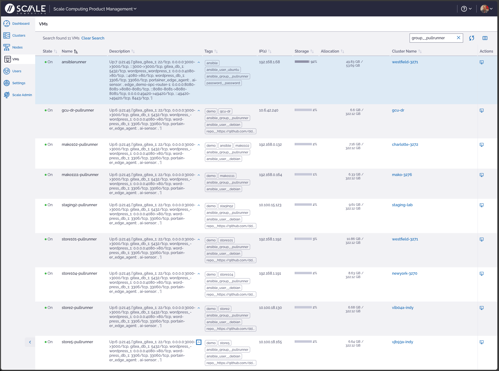

# edge-pull
ansible-pull setup

debian_vm_deploy_pullrunner.yml uses inventory file or command line variables to deploy the pullrunner VM to one or more hypercore clusters 

ansible_pull.yml sets up existing hosts for running ansible-pull schedule ... installs ansible, sets cron, creates inventory file for local hypercore cluster

local.yml is the default playbook run by pull runners

